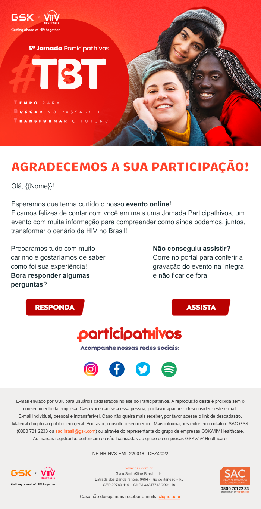

# participatory-journey ∺

### ✐ URL  
https://participaroty-journey.vercel.app/  

### ✏ Tecnologias  
   

### ✐ Descrição
Projeto desenvolvido para o teste técnico da [Prod | Agência Digital](https://www.prod.ag/).  
Para o teste, fora solicitada a reprodução desta página:  
  

Agradecimentos à Marina Mele pelo tempo, atenção e tratamento a mim dispensados quando de nossa conversa.  
Obrigado pela leitura e por acessar este projeto. Espero que goste! 🙂 

### ✎ Aos avaliadores

HTML e CSS Validator com zero erro e advertência.  
**Responsividade**: optei por aplicar conceitos de *mobile first*. Iniciei o projeto em 300px de  
largura. Ou seja, haverá uma boa visualização em dispositivos a partir de 300px de largura.  

No endereço que há no *footer*, usei a *tag* **address**, para que houvesse mais semântica.  
Isso explica porque a propriedade CSS *font-style* ficou com uma leve diferença em relação  
ao projeto original, *italic*, o padrão do conteúdo entre as *tags* **address**, e não *normal*.

A imagem do SAC não veio com o projeto como as demais.   
A que usei em minha réplica eu reproduzi da página oficial da GSK.  

Feito com 💝 por Leandro Medvedev. 🙋🏽 
🌆 Rio de Janeiro, 18 de maio de 2023.
